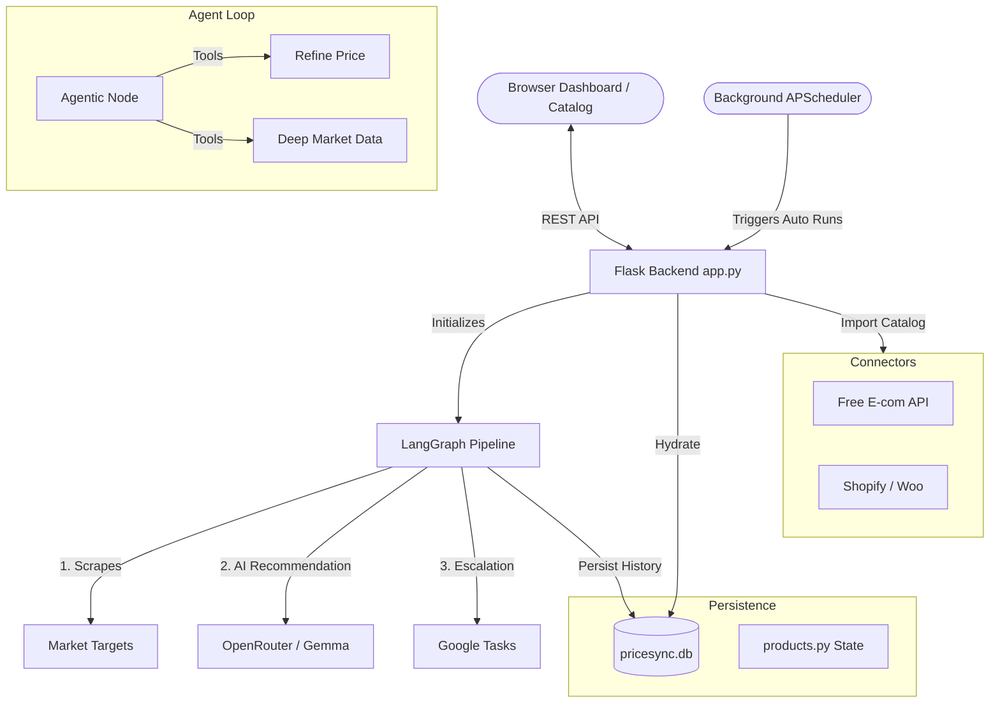
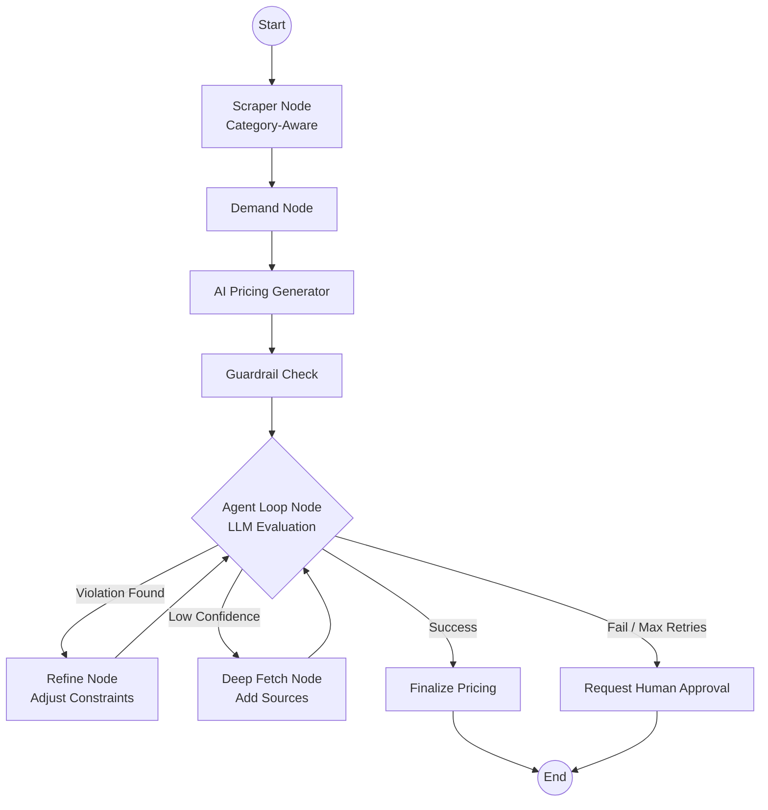

# PriceSync System Overview

## Project Purpose

`PriceSync` is a dynamic pricing agent for e-commerce products. It combines competitor scraping, demand scoring, LLM-driven pricing strategy, and pricing guardrails in a single workflow. The project exposes a Flask backend and a browser-based UI so users can select products, analyze competitor data, receive recommended prices, validate those recommendations, and apply them.

## High-Level Architecture

The project is organized into four primary layers:

1. **Frontend UI**
   - `templates/index.html`, `templates/catalog.html` and `static/app.js`
   - Allows users to select products, trigger the pricing agent, inspect competitor intelligence, and approve price changes.
   - The **Catalog Dashboard** provides an interface for importing products from external e-commerce platforms.

2. **Backend API**
   - `app.py`
   - Serves API endpoints for listing products, selecting a product, running the agent workflow, and applying price changes.
   - Handles catalog synchronization (`/catalog`, `/api/add-to-tracker`).

3. **Agent Workflow & Business Logic**
   - `agent.py`, `scrapers.py`, `demand.py`, `pricing.py`, `guardrails.py`, `products.py`, `db.py`, `scheduler.py`, `google_tasks.py`, `competitor_sources.py`
   - Executes a step-by-step process that scrapes competitor data, analyzes demand, generates recommendations, validates them, and optionally enters an **Agentic Loop** for refinement.

4. **External Integrations & Sync**
   - `ecommerce_connectors.py`
   - Facilitates product imports from platforms like Shopify, WooCommerce, and a specialized Free E-commerce Products API.

## Core Workflow

### 1. Product Selection & Cataloging

- Users can browse the main dashboard or the **Import Catalog**.
- In the Catalog, users can sync products from the Free E-commerce Products API (using `FreeApiConnector`) and add them to the main tracker.
- Added products are immediately available in `products.py` and persisted in `pricesync.db`.

### 2. Running the Agent (Two Graph Architectures)

The system supports two graph execution modes for pricing:

#### **A. Legacy Pipeline (Static)**
- A linear flow: `Scraper` → `Demand` → `Normalize` → `Pricing` → `Guardrail` → `Decision`.
- Logic is deterministic and routes based on preset thresholds to `AutoApply` or `HumanReview`.

#### **B. New Agentic Loop (Dynamic)**
- After the initial recommendation and guardrail check, the workflow enters an **Agentic Loop node**.
- An LLM evaluates the current internal state and determines if further action is needed using **Tools**:
  - `refine_price_tool`: Re-runs pricing with tweaked constraints if guardrails fail.
  - `fetch_deep_market_data`: Extends searches to more sources if confidence is low.
  - `request_human_approval`: Explicitly flags the run for human review via Google Tasks if boundaries are hit.
- The loop continues until a `FINAL_DECISION` is reached or a retry limit is hit.

### 3. Category-Aware Scraping

The agent uses `competitor_sources.py` to map product categories (e.g., *Electronics, Clothing, Home*) to the most relevant scraping adapters.
- **Electronics**: Amazon, Newegg.
- **Fashion**: Myntra, Amazon.
- **Marketplace**: eBay.

## File-Level Responsibilities

### `app.py`

- Creates the Flask application and registers all routes.
- **New Endpoints**:
  - `/catalog` → renders the synchronization dashboard.
  - `/api/add-to-tracker` → promotes a fetched product to the active price tracker.
- Manages the lifecycle of seeded and dynamically added products.

### `products.py`

- Manages in-memory product state and synchronizes with the `products` and `price_history` database tables.
- Provides thread-safe methods for product selection, status updates, and dynamic insertion.

### `agent.py`

- Orchestrates the `langgraph` state graphs.
- Contains the `AgentState` definition (`TypedDict`) which acts as the system's **Episodic Memory**.
- Defines both the `AGENT_GRAPH` (Legacy) and the enhanced agentic loop graph.
- Implements tools for the LLM-driven loop.

### `ecommerce_connectors.py`

- Provides a unified `EcommerceConnector` interface.
- Implements adapters for:
  - **Shopify**: Connects via Admin API.
  - **WooCommerce**: Connects via REST API.
  - **FreeApiConnector**: Pulls from a public JSON-based product registry.
- Uses `ConnectorFactory` for dynamic instantiation.

### `competitor_sources.py`

- Acts as a lookup table for category-to-source mappings.
- Provides suggested alternative sources if a category is under-represented.

### `scrapers.py`

- Enhanced with several new scraping adapters: `EbayAdapter`, `NeweggAdapter`, and `MyntraAdapter`.
- Includes fallback mock data generation for bot-protected services.

### `demand.py`

- Extracts market signals (scarcity, velocity, competitor density) to compute a demand score (0.0 to 1.0).

### `pricing.py`

- Interacts with OpenRouter LLMs to generate high-confidence pricing recommendations.
- Implements heuristic fallbacks for offline or budget-constrained scenarios.

### `guardrails.py`

- Enforces business safety rules such as minimum margin percentage, maximum price volatility, and category-level positioning.

### `db.py` and Database Overview

The system uses `pricesync.db` with several key tables:
- **`price_history`**: Every decision, including metadata like `demand_score`, `our_price`, and `guardrail_passed`.
- **`scheduler_log`**: Records autonomous runs triggered by the background job.
- **`product_sources`**: Stores products fetched from external connectors before they are tracked.

### `google_tasks.py`

- Automates escalation by creating tasks for human reviewers when the agent faces low confidence or guardrail breaches.

## System Architecture & Data Flow

### Overall System Architecture

### Agentic Loop Pipeline (Modern)

## Configuration

### Environment Variables

- `OPENROUTER_API_KEY`: Required for AI pricing.
- `BASE_URL`: For Google OAuth.
- `SHOPIFY_ACCESS_TOKEN` / `WOOCOMMERCE_SITE_URL`: For optional e-commerce sync.

## How to Run

1.  Run `pip install -r requirements.txt`.
2.  Configure `.env` with keys.
3.  Launch `./run.sh` or `python app.py`.
4.  Visit `http://localhost:5001`.
5.  (Optional) Visit `http://localhost:5001/catalog` to import new products.

## Summary

`PriceSync` has evolved from a static pricing script into an **Autonomous Pricing Agent**. It leverages category-specific market intelligence, an agentic retry loop, and a robust catalog synchronization system to manage e-commerce pricing at scale while maintaining human-in-the-loop safety via Google Tasks.
